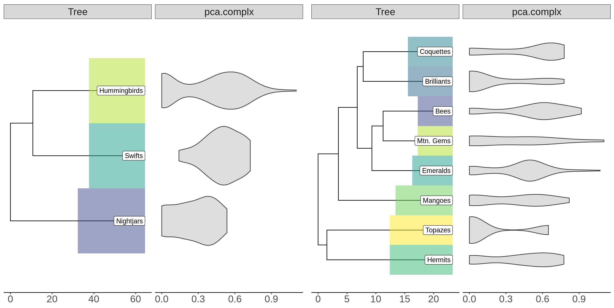

# Hummingbird song evolution

> Unvailing the evolutionary dynamics that generated complex vocalizations in hummingbirds

## Table of contents
* [General info](#general-info)
* [Analyses](#Analyses)
* [To do list](#to-do-list)
* [Contact](#contact)

## General info

This project explores the macroevolutionary significance of song learning in hummingbirds from a phylogenetic comparative perspective. The project aims to compare several aspects of vocal complexity evolution between hummingbirds and their non-vocal learning sister groups (Apodidae and Caprimulgidae) in order to isolate evolutionary dynamics potentially related to vocal learning.

## Analysis

* [Binding trees from different sources](https://rpubs.com/marcelo-araya-salas/598340)
* [Mapping acoustic traits on phylogenies]( https://htmlpreview.github.io/?https://github.com/maRce10/hummingbird_song_evolution/blob/master/analysis/Acoustic_parameters_mapped_on_phylogenies.html)
* [Branchwise rates](https://rpubs.com/marcelo-araya-salas/598332)

## To-do list

* Evolutionary covariances of complex
* Get direccionality of complexity during evolution
* Compare rates between clades (see [this link](https://stats.stackexchange.com/questions/130389/bayesian-equivalent-of-two-sample-t-test))
* Evaluate evolutionary covariation of rates

## Status
Project is: _in progress_

## Contact
Created by [Marcelo Araya-Salas](https://marceloarayasalas.weebly.com/) - feel free to contact me!